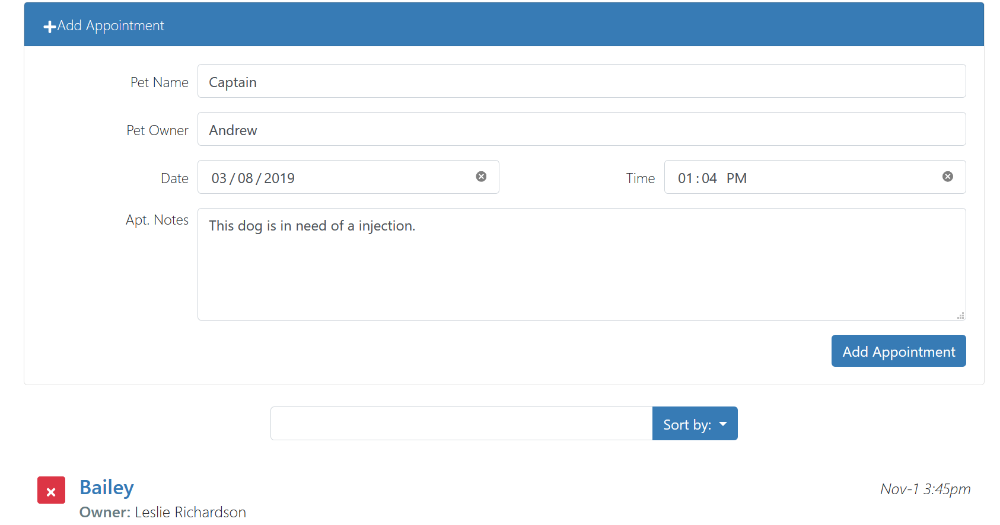
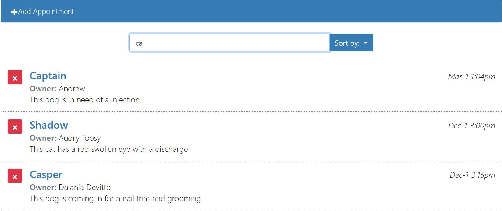
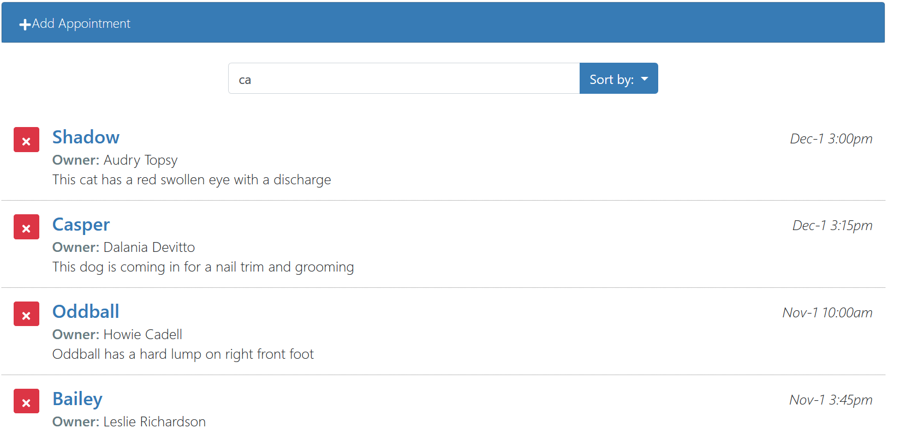

This is a React Project(https://www.lynda.com/React-js-tutorials/React-js-Building-Interface/808689-2.html) 
that uses standard libraries such as Jquery, Bootstrap, and react icons. Created with Create-React-App.

<ul><b>Topic Covered:</b></ul>
  <li>Fetching data from a JSON file</li>
  <li>Creating subcomponents</li>
  <li>Passing data through props</li>
  <li>Adding and editing records</li>
  <li>Searching and sorting</li>

Adding Appointment:

Searching Appointment:

Deleting Appointment:

Ren
3/8/2019